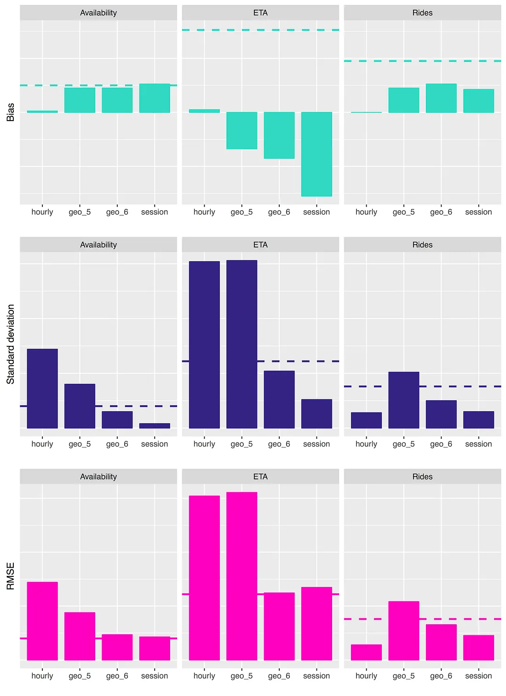

# Network interference in A/B testing

- A/B testing is not a fully solved problem.
- In ridesharing marketplace systems where supply and demand are affected by evolving network dynamics, user level RCT violates SUTVA and bias treatment effect.

- This post summarizes Part 1 and 3 of the Lyft Engineering series by Nicholas Chamandy, ["Experimentation in a Ridesharing Marketplace: Interference Across a Network"](https://eng.lyft.com/experimentation-in-a-ridesharing-marketplace-b39db027a66e), written in 2016. 

# The Problem: Network Dynamics and Pricing

- Consider a simple **undersupply** scenario: User A, User B, and **one available driver**.
- This triggers **"Prime Time" (surge pricing)**, which displays **prime time** badge in the Lyft app and the price is 1.5x higher than normal.
- We want to estimate the causal effect of subsidy for surge pricing (W=0: surge pricing, W=1: subsidy for surge pricing).
- Simplifying assumption: driver do not react to surge pricing. Only passengers react to surge pricing.

## Network dynamics from supply and demand elasticity
- Since there is only one driver, if user A requests a ride, user B cannot request a ride. 
- Therefore, user A's request affects user B's outcome. This is a violation of SUTVA.
- In a more general setup, we can say, surge pricing subsidy (treatment) is known to have strong network effects, as subsidizing for user A can mean that user B is less likely to have a driver nearby when she opens the Lyft app. This happens because during times of undersupply, users who see a cheaper price will tend to snap up the available drivers.

## Causal estimand
- Let $Y_A$ and $Y_B$ be the number of rides completed by user A and user B, respectively. 
- Let $W_A$ and $W_B$ be the treatment assignments for user A and user B, respectively. 
- We are interested in the causal effect of the subsidy on the total number of rides completed, which is given by 

\begin{equation*}
    \tau := E[Y_A + Y_B | W_A=1, W_B=1] - E[Y_A + Y_B | W_A=0, W_B=0]
\end{equation*}

- This definition is diffferent from ATE where unit indicators are collapsed. Since SUTVA is violated, we cannot use the standard ATE definition.

## Rider behavior model
- Whether user A opens the app first or user B opens the app first is uniformly random. 
- If no prime time, the user requests a ride with probability 1.
- If surge pricing is on, the user requests a ride with probability 0.5. 

## If there are parallel universes

### **Global Control (No Subsidy for both)** 
- Both users see Prime Time. 
- By 0.5 + (1-0.5)*0.5 = 0.75 and symmetry, we have 

\begin{equation*}
    E[Y_A + Y_B | W_A=0, W_B=0] = 0.5*0.75 + 0.5*0.75 = 0.75
\end{equation*}

### **Global Treatment (Subsidy for All)** 
- Neither sees Prime Time. Wait times aside, the first one to request gets the single driver.
- The expected number of completed rides is exactly 

\begin{equation*}
    E[Y_A + Y_B | W_A=1, W_B=1] = 0.5 + 0.5 = 1
\end{equation*}
   

The true causal treatment effect of the subsidy is an increase in completed rides from 0.75 to 1.0, a **33% increase**.

## Naive A/B Testing: Randomizing Users
- In reality, there is no parallel universe. We randomly pick a user and give subsidy. Another user do not receive subsidy. 
- without loss of generality assume user A is in control group (surge pricing) and user B is in treatment group (subsidy). 

### User A (Control; no subsidy; surge priced)
- Has a 50% chance to request. However, User A can only get a ride if they open the app first (50% chance). Otherwise, User B (subsidized) will request immediately and take the driver. 
- User A's expected rides is 

\begin{equation*}
    E[Y_A + Y_B | W_A=0, W_B=1] = 0.25
\end{equation*}

- User A represents all users in parlalel universe 1. So $E[Y_A + Y_B | W_A=0, W_B=0]$ is estimated as $E[Y_A + Y_B | W_A=0, W_B=1] = 0.25$ 
- This is smaller than the true value 0.75

### User B (Treatment; subsidy; not surge priced)
- Opens app first (0.5) and gets a ride (*1) + opens the app late (0.5) but user A did not request a ride (*0.5) then user B gets a ride (*1) 

\begin{equation*}
    E[Y_A + Y_B | W_A=1, W_B=0] = 0.5*1 + 0.5*0.5*1 = 0.75
\end{equation*}

### Estimated Treatment Effect

\begin{equation*}
    \hat{\tau} = \frac{0.75 - 0.25}{0.25} = 2
\end{equation*}

The naive A/B test estimates a 200% increase in rides, overestimating the true global effect (33%) by a factor of six! 

## Statistical Interference

- This bias is due to **interference**, which is a violation of the Stable Unit Treatment Value Assumption ([SUTVA](https://jong-min.org/blog/2025/causal-assumption-sutva/)). 

- A key assumption in SUTVA is that a unit's potential outcomes are unaffected by the group assignments of *other* units. 

-  When this is violated, treatment effect estimation is biased. 

### Upward interference bias
- In our scenario assigning User B to treatment increased the ride probability of B, and this in turn decresases the ride probability of A, because there is only one driver.
- In other words, When User B's Prime Time was subsidized, User B "stole" the single driver with much higher probability, tanking User A's expected rides down.
- This led to exaggerating the treatment effect.

### Downward interference bias
- There can be opposite case where interference can lead to underestimating the treatment effect: infectious disease. 
- The effectiveness of a vaccine on one subject's outcomes depends on how many others in his social circle also received the immunization. 
- In other words, one subject's treatment can offer protective benefit to other, possibly untreated subjects.
- The result is that the measured difference between treated and untreated subjects (the benefit attributed to the vaccine) will shrink. 

## Remedies

- Interference cannot be completely eradicated in a two-sided marketplace.
- However, alternative experimental units give varying levels of protection against bias.
- You can randomize beyond the User level at coarser units. 

- For example, randomizing by city or by time interval provides strong protection against interference bias.

- However, it pays a steep cost: **Increased Variance**. Coarser randomization units drastically decrease your effective sample size and introduce more between-unit heterogeneity.

- In practice, data scientists think:

| Randomization Unit              | Bias | Variance |
| :------------------------------ | :--- | :------- |
| **Space (geohash)**             | High | Low      |
| **Time interval (hour)**        | Mid  | Mid      |
| **Coarse spatial units (city)** | Low  | High     |
 

In its earlier days, Lyft dealt with this by randomizing **time intervals** (alternating the network between a global treatment period and a global control period) to combat bias despite the higher variance. 

# Remedies in practice (actually, simulations)
We run A/B testing with three different randomization units:
- Alternating time intervals (one hour)
- Randomized coarse spatial units (geohashes at granularity 5)
- Randomized fine spatial units (geohashes at granularity 6)
- Randomized user sessions

## Metrics
We focus on three key metrics for this simulation study.  In all cases we measure percent changes in the metric in the treatment group relative to the control group.
1. **Availability**: defined as the proportion of user app opens for which there is an available Lyft driver within some context-dependent radius. Since we are handling undersupply, this is an important metric.
2. **ETA**: the average (across user sessions) estimated time of arrival (ETA) of the nearest available driver. ETA is one measure of the quality of Lyft’s service levels.
3. **Rides**: the number of completed Lyft rides, normalized by group size. Rides is Lyft's most important top-line business metric, but in a simulation setting is somewhat dependent on the models of passenger and driver behavior.

## Ground truth
To get the ground truth values, we run simulation over the entire period twice: 
- One under global control (everyone gets surge pricing)
- One under global treatment (everyone gets subsidy for surge pricing)

As a result, we observe the following ground truths about the treatment:
- A decrease in availability
- An increase in ETAs
- An increase in total rides

## Results

# References 
- Chamandy, N. (2016). *Experimentation in a Ridesharing Marketplace: Interference Across a Network Part 1 : interferences across a network*. Lyft Engineering. Retrieved from https://eng.lyft.com/experimentation-in-a-ridesharing-marketplace-b39db027a66e
-  Chamandy, N. (2016). *Experimentation in a Ridesharing Marketplace: Interference Across a Network Part 3: Bias and Variance*. Lyft Engineering.  https://eng.lyft.com/experimentation-in-a-ridesharing-marketplace-f75a9c4fcf01