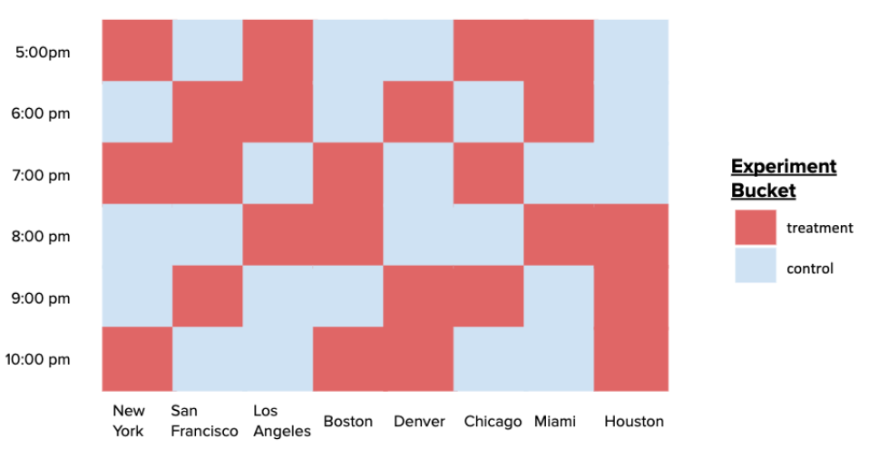
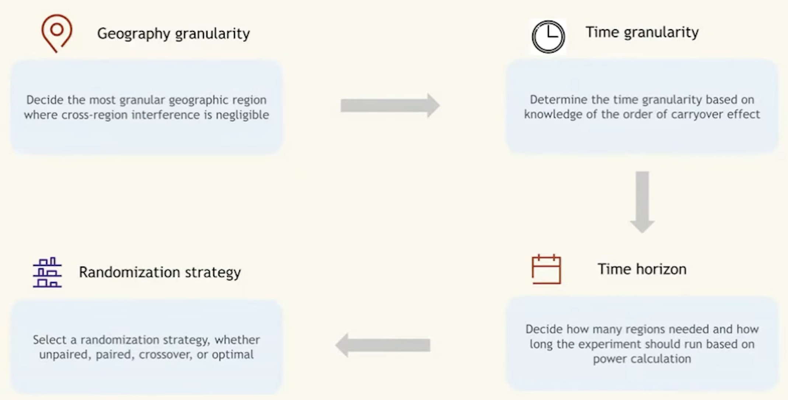

# Why Use Switchback Experiments?
- Consider the following scenario at DoorDash:
>While A/B testing is commonly used at DoorDash, it is not optimal for testing our assignment algorithm because the assignment of one delivery to a Dasher depends heavily on the outcome of another delivery’s assignment to a Dasher. For example, say there are two deliveries that need to be assigned and only one Dasher is available. If we apply an algorithm change to one delivery which will assign it quicker than the standard, we risk impacting the second “control” delivery’s assignment since the “treated” delivery would most likely be assigned to the only Dasher.

- Here's a similar scenario at [Lyft](https://jong-min.org/blog/2025/exp-network-interference/). 
- Overall, this type of problem is called **network interference** and very common in two-sided marketplace, where supply and demand interact with each other. 
  - More simply, recall that adjacent users share the same pool of drivers or Dashers.
  - Network interference is also common in social media  such as instagram and linkedin.
  - Network interfernece is violation of **Stable Unit Treatment Value Assumption (SUTVA)**—specifically the assumption of *no interference*, meaning one user's treatment does not affect another user's potential outcome.
- Finally, sometimes, we just can't run fine grained unit level randomizaiton due to technical constraints.
 
  
 

# What is a Switchback Experiment?

- **Definition**: Switchback tests randomize experiment buckets on geographic region and time "units" rather than users to reduce the impact of **dependencies in observations** on our experiment results.
- By randomizing on these **regional-time "units"**, all deliveries and Dashers in each unit are exposed to the same type of algorithm, in turn reducing the impact of dependencies among deliveries in two different experiment buckets.
- An illustration of this randomization structure is shown below.

- Once randomization happens on the region-time buckets, each delivery is bucketed into to a treatment or control group based on that of its region and time, and as a result, we get 
1. a nested data structure: multiple deliveries are part one of one bucket, and thus, observations are not independent of each other.
2. a smaller number of more independent "units" available for analysis.

- Inside each bucket, the granularity of unit is can be set by the experimenter. This choice is cruical because if affects the variance of the estimate. 

# How to conduct a test
## Bucket level summarization approach
- A very simple way of analyzing switchback experiment is to compute average outcome over the data in each bucket and run a t-test with bucket averages.
- This resolves the dependnecy problem inside the bucket: the unit outcomes are highly correlated to each other via region-time covariates. The data is not an RCT in unit level, thus t-test is not causal.
- We believe that the unit level outcomes are sufficiently independent of each other (that's the whole point of bucket level randomization!)
- The drawbacks:
  1. Sample size is significantly smaller than user level analysis, leading to lower statistical power.
  2. We lose important information about the treatment effect at the user level. Now that we have only one observation per bucket, it is not easy to look for heterogenous treatement effect. For example, the treatment (algorithm change) might have distinct effects on delivery times in regional-time units with few deliveries (i.e. 1am) versus those with many deliveries (i.e. 5pm). 

- For small sample size, consider the following scenario:
  - If there are 100,000 users per city city, your sample size is $N = 100,000$. 
  - In a switchback experiment running for 2 weeks with 30-minute windows in one city, your effective unit of randomization is the time window. 
  - Number of windows = 14 days $\times$ 48 windows/day = **672 time windows.**
  - The effective sample size crashes from $100,000$ to $672$, vastly increasing the standard errors of your estimates and lowering statistical power.
  - **Solution:** Run tests for longer durations, aggregate across multiple independent cities, or employ advanced variance reduction techniques (like CUPED or synthetic controls) to increase power.
## Unit-level t-tests with variance reduction
This is a observational study approach, since on the unit level the treatment is not RCT. But we can list covaraites that affect the treatment assignment, of course including the region and time:

\begin{equation*}
    X_i \{region_i, time_i, week number (seasonality), total order value, ...\}
\end{equation*}
So that we can assume ignorability:
\begin{equation*}
    (Y_i(0), Y_i(1)) \perp \text{Bucket}_i | X_i
\end{equation*}

TBD.

# How to plan
The core plan is determining the experimental unit and number of it.
1. **Define the Region:** Choose a specific geographical boundary (e.g., Manhattan, San Francisco).
2. define the geographic granularity (metro, zone, stores)
   - pick granilariy so that neighboring regions do not intereact much (as possible)
3. **Define the Granularity (Time Window):** Partition the timeline into discrete blocks (e.g., 30, 60, or 120 minutes).  determine based on expeirnce on carryover effect
4. how long would we run the switchback experiment? sample size?
5. **Random Assignment:** many options of randomizaiton algorithm (paired, unparid...)  (often alternating or using Markov chains to maintain balance) to assign each window to Treatment or Control.
6. **Execute:** 
   - 12:00 PM - 12:30 PM: Control (Standard dispatch algorithm for *all* users).
   - 12:30 PM - 1:00 PM: Treatment (New dispatch algorithm for *all* users).
   - 1:00 PM - 1:30 PM: Treatment ...

# Trade-offs and Challenges

While switchbacks mitigate user-to-user interference, they introduce completely different challenges.

## 1. Carryover Effects (Temporal Interference)
By switching back and forth, the system's state in one time window bleeds into the next. 
- *Example:* If a Treatment window (e.g., deep discounts) clears the map of all available couriers, the subsequent Control window starts completely starved of supply. The Control group's poor performance is essentially an artifact of the Treatment group's success.
- **Solution:** A common remedy is applying a **"burn-in" or "washout" period**. If the window is 60 minutes, experimenters might discard the first 15 minutes of data from each window, only analyzing the period where the system has stabilized into the new state. Alternatively, increasing the duration of the time window dilutes the carryover effect.

# Power and sample size calculation
how many randomization units do we need? (not how many users or orders)
| Case                                                                                    | Method                                                                                                                                   |
| :-------------------------------------------------------------------------------------- | :--------------------------------------------------------------------------------------------------------------------------------------- |
| The randomization unit (e.g., metro-day) is the same as the analysis unit               | Power calculation based on two sample t test (similar to power calculation for A/B test)                                                 |
| The randomization unit (e.g., metro-day) is higher than the analysis unit (e.g., order) | **Delta method** for variance calculation (need to account for **correlation across analysis units** within the same randomization unit) |

# Analze a switchback experiment
- how to compute the treatment effect
- how to conduct statistical inference
- how can we look for heterogeneous treatment effects

## treatment effect
we look for:
- overall treatment effect
- heterogeneous treatment effects
  - accross different metros
  - day of week effect
  - and more
  
THe following is a typical result we get from a switchback experiment
| order | zone | date       | metro | metric | treatment |
| :---- | :--- | :--------- | :---- | :----- | :-------- |
| 1     | 1    | 2022-01-01 | SF    | 0.5    | 1         |
| 2     | 1    | 2022-01-01 | SF    | 0.4    | 1         |
| 3     | 1    | 2022-01-02 | SF    | 0.3    | 0         |
| 4     | 2    | 2022-01-01 | SF    | 0.4    | 0         |
| 5     | 2    | 2022-01-01 | SF    | 0.1    | 0         |
| 6     | 2    | 2022-01-02 | SF    | 0.5    | 1         |
| 7     | 3    | 2022-01-01 | LA    | 0.3    | 0         |
| 8     | 3    | 2022-01-02 | LA    | 0.2    | 1         |

## Inference
| Case                                                                                    | Method                                                                                                                  |
| :-------------------------------------------------------------------------------------- | :---------------------------------------------------------------------------------------------------------------------- |
| The randomization unit (e.g., metro-day) is the same as the analysis unit               | 1. Two sample t-test 2. Permutation test 3. More advanced modeling                                                |
| The randomization unit (e.g., metro-day) is higher than the analysis unit (e.g., order) | 1. Two sample z-test with variance calculated from the Delta method 2. Permutation test 3. More advanced modeling |
# Conclusion

User-level A/B testing is fundamentally broken for interventions that impact shared physical supply. Despite the challenges of carryover effects and lower statistical power, switchback experimentation remains the gold standard for measuring the true global impact of marketplace algorithms.

# References
- Yimin Yi, Experiment Rigor for the Design and Analysis of Switchback Experiments. (2022) Youtube video
[link](https://youtu.be/pJcBAZD33SA?si=5a0VAvg1Pqn7JCfI)
- Nextmv, What is switchback testing for decision models? (2024) Youtube video
[link](https://youtu.be/pzXwmPZCTcA?si=bnIUVfI6Czp6Inxn)
- Carla Sneider and Yixin Tang, Experiment Rigor for Switchback Experiment Analysis (2019), DoorDash blog.
[link](https://www.doordash.com/engineering/experiment-rigor-for-switchback-experiment-analysis/)

