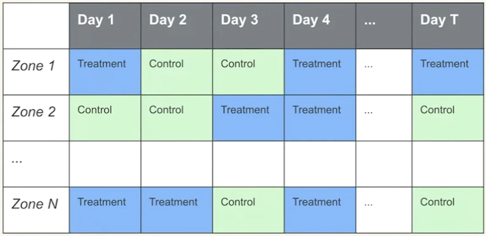

# What is a Switchback Experiment?

A **switchback experiment** (or time-split experiment) is an A/B testing methodology where the treatment assignment alternates over time within the same geographic region, rather than varying across individuals at the same time. 

Instead of randomly assigning users to Treatment or Control, you divide time into discrete, short windows (e.g., 30-minute or 1-hour intervals) and randomly assign each time window to either the Treatment or Control state. During that window, **every user** in the region experiences the assigned state.

Inside each sell, the granularity of unit is can be set by the experimenter. This choice is cruical because if affects the variance of the estimate. 

# Why Use Switchback Experiments?

- when we can't run fine grained unit level randomizaiton
- network effect (social meadia such as instagram, and two sided marketplace such as lyft, uber, doordash)
  

In traditional user-level A/B testing, we rely on the **Stable Unit Treatment Value Assumption (SUTVA)**—specifically the assumption of *no interference*, meaning one user's treatment does not affect another user's potential outcome.

However, in two-sided marketplaces with shared supply and demand (like Lyft, Uber, or DoorDash), user-level randomization fails catastrophically due to **network interference**. 
- If a new feature makes Treatment passengers request rides faster, they consume the limited supply of drivers.
- Control passengers, sharing the exact same driver pool, will now experience longer wait times and fewer available rides.
- This "crowd-out effect" wildly exaggerates the difference between the two groups, biasing the Average Treatment Effect (ATE).

Switchback experiments solve this by treating the entire marketplace simultaneously. Because everyone in the region experiences the identical algorithm, pricing model, or dispatch logic at the same time, user-to-user interference is heavily mitigated.

# How It Works

1. **Define the Region:** Choose a specific geographical boundary (e.g., Manhattan, San Francisco).
2. define the geographic granularity (metro, zone, stores)
   - pick granilariy so that neighboring regions do not intereact much (as possible)
3. **Define the Granularity (Time Window):** Partition the timeline into discrete blocks (e.g., 30, 60, or 120 minutes).  determine based on expeirnce on carryover effect
4. how long would we run the switchback experiment? sample size?
5. **Random Assignment:** many options of randomizaiton algorithm (paired, unparid...)  (often alternating or using Markov chains to maintain balance) to assign each window to Treatment or Control.
6. **Execute:** 
   - 12:00 PM - 12:30 PM: Control (Standard dispatch algorithm for *all* users).
   - 12:30 PM - 1:00 PM: Treatment (New dispatch algorithm for *all* users).
   - 1:00 PM - 1:30 PM: Treatment ...

# Trade-offs and Challenges

While switchbacks mitigate user-to-user interference, they introduce completely different challenges.

## 1. Carryover Effects (Temporal Interference)
By switching back and forth, the system's state in one time window bleeds into the next. 
- *Example:* If a Treatment window (e.g., deep discounts) clears the map of all available couriers, the subsequent Control window starts completely starved of supply. The Control group's poor performance is essentially an artifact of the Treatment group's success.
- **Solution:** A common remedy is applying a **"burn-in" or "washout" period**. If the window is 60 minutes, experimenters might discard the first 15 minutes of data from each window, only analyzing the period where the system has stabilized into the new state. Alternatively, increasing the duration of the time window dilutes the carryover effect.

## 2. Plunging Statistical Power (High Variance)
In a user-level A/B test with 100,000 users, your sample size is $N = 100,000$. 
In a switchback experiment running for 2 weeks with 30-minute windows in one city, your effective unit of randomization is the time window. 
- 14 days $\times$ 48 windows/day = **672 time windows.**
- The effective sample size crashes from $100,000$ to $672$, vastly increasing the standard errors of your estimates and lowering statistical power.
- **Solution:** Run tests for longer durations, aggregate across multiple independent cities, or employ advanced variance reduction techniques (like CUPED or synthetic controls) to increase power.

# Power and sample size calculation
how many randomization units do we need? (not how many users or orders)
| Case                                                                                    | Method                                                                                                                                   |
| :-------------------------------------------------------------------------------------- | :--------------------------------------------------------------------------------------------------------------------------------------- |
| The randomization unit (e.g., metro-day) is the same as the analysis unit               | Power calculation based on two sample t test (similar to power calculation for A/B test)                                                 |
| The randomization unit (e.g., metro-day) is higher than the analysis unit (e.g., order) | **Delta method** for variance calculation (need to account for **correlation across analysis units** within the same randomization unit) |

# Analze a switchback experiment
- how to compute the treatment effect
- how to conduct statistical inference
- how can we look for heterogeneous treatment effects

## treatment effect
we look for:
- overall treatment effect
- heterogeneous treatment effects
  - accross different metros
  - day of week effect
  - and more
  
THe following is a typical result we get from a switchback experiment
| order | zone | date       | metro | metric | treatment |
| :---- | :--- | :--------- | :---- | :----- | :-------- |
| 1     | 1    | 2022-01-01 | SF    | 0.5    | 1         |
| 2     | 1    | 2022-01-01 | SF    | 0.4    | 1         |
| 3     | 1    | 2022-01-02 | SF    | 0.3    | 0         |
| 4     | 2    | 2022-01-01 | SF    | 0.4    | 0         |
| 5     | 2    | 2022-01-01 | SF    | 0.1    | 0         |
| 6     | 2    | 2022-01-02 | SF    | 0.5    | 1         |
| 7     | 3    | 2022-01-01 | LA    | 0.3    | 0         |
| 8     | 3    | 2022-01-02 | LA    | 0.2    | 1         |

## Inference
| Case                                                                                    | Method                                                                                                                  |
| :-------------------------------------------------------------------------------------- | :---------------------------------------------------------------------------------------------------------------------- |
| The randomization unit (e.g., metro-day) is the same as the analysis unit               | 1. Two sample t-test 2. Permutation test 3. More advanced modeling                                                |
| The randomization unit (e.g., metro-day) is higher than the analysis unit (e.g., order) | 1. Two sample z-test with variance calculated from the Delta method 2. Permutation test 3. More advanced modeling |
# Conclusion

User-level A/B testing is fundamentally broken for interventions that impact shared physical supply. Despite the challenges of carryover effects and lower statistical power, switchback experimentation remains the gold standard for measuring the true global impact of marketplace algorithms.

# References
- Yimin Yi, Experiment Rigor for the Design and Analysis of Switchback Experiments. Data Science Connect (2022) Youtube video
[link](https://youtu.be/pJcBAZD33SA?si=5a0VAvg1Pqn7JCfI)