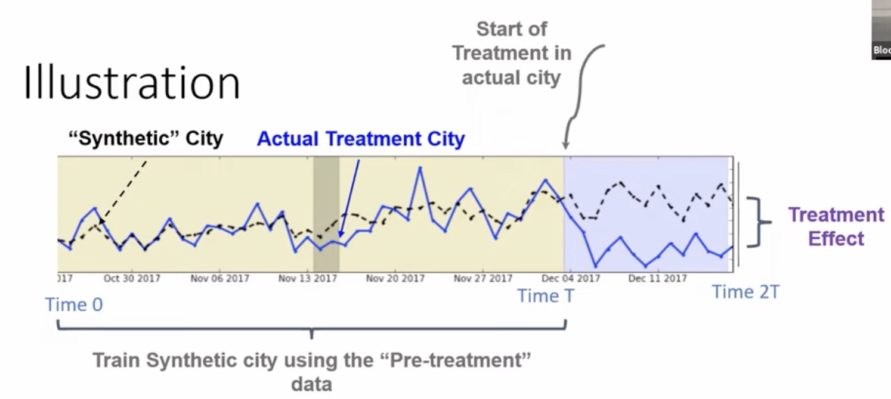

While randomized controlled experiments (A/B testing) remain the gold standard for drawing causal inferences, there are many scenarios where they are deeply flawed or impossible to implement. 

Standard experimental techniques—ranging from individual-level A/B testing to spatial/cluster randomization or switchback experiments—become unworkable when:

- The product is public-facing and a rollout is difficult to undo.
- The change is highly sensitive, so you cannot safely launch it in many locations at once.
- Interference is network- or city-wide, breaking the stable unit treatment value assumption (SUTVA).
- The effect takes a long time to materialize.

In these cases, we rely on causal inference techniques designed for observational data. Arguably the most important innovation in policy evaluation in recent decades is **Synthetic Control**.

### Uber Cash Trips: The Spillover Effect

Uber launched in the US as a card-only service but later expanded into cash-heavy markets like Latin America and India. While accepting cash unlocked new rider segments, it introduced operational friction—specifically, drivers having to carry change and Uber struggling to collect its commissions.

To evaluate this, Uber ran an experiment: showing drivers the payment method upfront to measure the impact on trip acceptance rates and unpaid service fees.

However, standard A/B testing fails here due to network interference (the spillover effect). If drivers in the treatment group prefer cash and systematically decline card trips, they will consume the supply of cash trips. Consequently, the control group is starved of cash trips, artificially skewing the experiment's results even though they cannot see the payment types.

# Synthetic Control

## testimonials
- Guido Imbens, the 2021 Nobel laureate in Economics, wrote in his 2017 paper with Susan Athey <d-cite key="athey2017state"></d-cite>:
> Synthetic control “is arguably the most important innovation in the policy evaluation literature in the last 15 years"
- Bill & Melinda Gates Foundation uses synthetic control to evaluate the impact of their interventions, since the effect of education  takes a long time to materialize.
- tech companies love this.
  - If Uber changes the pricing algorithm, it is hard to roll it back. 
  - THe usual practice is to run a test in one city, and if the result is good, expand to the next one, and on and on. 

## When to use this
- When running standard experiments is hard:
  - Product is “public-facing” – hard to roll back
  - Interference really network/city wide, so spatial randomization less effective 
  - Sensitive change, so can’t launch in many cities at once
  - It takes a long time for effect to occur
- So, you launch a new feature in just *one* city (e.g., Miami) at time $T$. This is your treatment city. 
- Let's assume no interfence between cities. 
- We need a control to estimate the global  treatment effect  $Y_1 - Y_0$.
- To measure this, we need to answer the counterfactual: *"What would have happened to Miami if we didn't launch the feature?"* We don't have this information, what we have is:
  
  ### Past Miami (Time $0$ to $T$)
  - The problem is *seasonality* and time-based confounding.
  - The future might naturally differ from the past.
  - More generally, **standard marketplace vairability or growth is usually way bigger than treatment effect.**
  - read Airbnb blog post by Jan Overgoor.
  
  ### Seasonality adjustd Miami
  - problem: unforseen events like covid.
  - seasonality adjustment is based on past, so it cannot adjust for future events.
- ### Another city 
  - e.g., Houston or Atlanta from Time $T$ to $2T$
  - seasonlaity and future event problem addressed? maybe, if the city is very similar to miami in relevent aspects
  - Some city can be similar to Miami. But it is hard to find a perfect analogue for Miami.

## The Main Idea

- Instead of picking one flawed control, **Synthetic Control** construct a "Synthetic Miami" using a weighted average of several untreated cities (the "donor pool"). 

- We optimize the weights using  the pre-treatment period data (Time $0$ to $T$),  so that "Synthetic Miami" perfectly matches the actual Miami's *metrics* (e.g., number of orders, revenue, etc.)
- THen put these weights on the post treatment  (Time $T$ to $2T$) data to create a synthetic counterfactual.
- The underlying assumption is that if Synthetic Miami accurately tracked real Miami in the past, its trajectory in the post-treatment period (Time $T$ to $2T$) represents the valid counterfactual of what real Miami would have looked like without the treatment.

### Example
- The treatment is lauching a new feature in Miami at Noveber 2017.
- The metric is the number of ridesc completed.
- We find weights so that the weighted average of control cities' number of rides (time series curve) matches Miami's number of rides (time series curve) in the pre-treatment period.

- there are numerous algorithms to find these weights. 
The treatment effect is simply the divergence between the actual data in Miami and the projection of Synthetic Miami after time $T$.

---

# Experimentation Culture

When running experiments in the tech industry, the goal fundamentally shifts away from purely "scientific" rigidity.

## Classical Power Analysis vs. Discovery-Driven Experimentation
In a traditional scientific approach, experiments are sized (via Power Analysis) strictly to reject false hypotheses and accept true ones. You set a sample size $N$ optimized to detect an effect $X$ with statistical significance, and you run the test to completion. 

**The Problem:** This wastes time and sample size. Tech companies have to prioritize velocity. They have an endless backlog of features to test, and the limitation is network bandwidth/sample size.
- You *want* to quickly launch massive wins.
- You *never* want to launch harmful products.
- You *don't care* about perfectly measuring the exact effect size of a mediocre product.

**The Solution:** Discovery-driven or **Adaptive Experimentation**. 
We "peek" at the results smartly using upper and lower dynamic thresholds. If a product is clearly amazing early on, we stop the experiment, declare victory, and ship it. If it’s clearly a dud or causing harm, we shut it down immediately to save sample size for the next idea.

## The Universal Holdout
Standard A/B tests isolate single features, making it impossible to answer: *"What is the aggregate effect of everything we shipped this quarter on long-term retention?"*

To measure long-term, multi-feature impact, companies utilize a **Universal Holdout**. At the beginning of a quarter (or year), a small set of users is completely held back from receiving *any* new products or experiments. At the end of the time frame, analyzing the difference between this universal control group and the general population reveals the cumulative impact of the entire product roadmap.

---

# Miscellaneous Topics

### Ethics in Experimentation
When does an experiment cross ethical boundaries?
- **Challenge Trials:** (e.g., intentionally infecting volunteers during COVID vaccine testing to speed up results).
- **Product Degradation:** Is it ethical to purposely break your product just to measure its baseline value? (e.g., What if Uber intentionally disabled surge pricing on New Year's Eve, causing massive supply shortages just to measure the true causal impact of surge?)

### Specific Treatment Effects
Depending on the randomization and compliance, evaluating causality yields different definitions of "Effect":
- **GATE (Global Average Treatment Effect):** How the world where *everyone* gets treatment compares to the world where *everyone* gets control.
- **ATE (Average Treatment Effect):** On average, how an individual's outcome changes under treatment vs. control (assumes SUTVA/no interference).
- **CATE / LATE (Complier / Local Average Treatment Effect):** The effect strictly on those who *complied* with the treatment assignment. (e.g., If the treatment is *access* to a vaccine, CATE only measures the effect on the people who actually took the shot).
- **Heterogeneous Treatment Effects:** When the treatment effect systematically differs across subpopulations (e.g., a discount code heavily lifting orders for students but doing nothing for professors).
