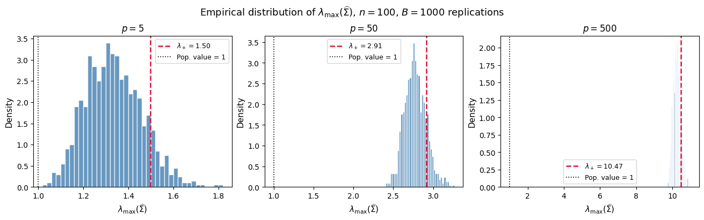
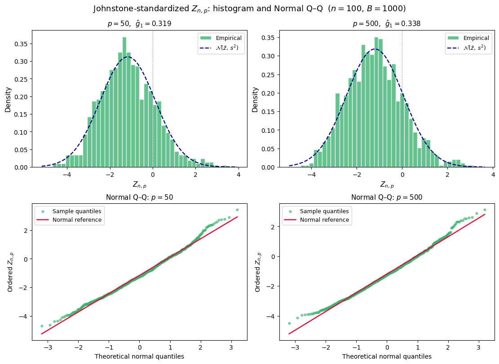

# Setup
To avoid mean estimation, suppose we observe random vectors from a zero-mean distribution. For example, $x_1, \ldots, x_n \overset{\text{i.i.d.}}{\sim} \mathcal{N}(0, I_p)$.

Then a natural estimator is the sample covariance matrix (without mean estimation) defined as

<p>$$\widehat{\Sigma} = \frac{1}{n} \sum_{i=1}^{n} x_i x_i^{\top} = \frac{1}{n} X^{\top} X,$$</p>

where $X \in \mathbb{R}^{n \times p}$ has the $x_i$ as its rows.

**Central question.** Does the largest eigenvalue $\lambda_{\max}(\widehat{\Sigma})$ concentrate near the population value $1$ as $n \to \infty$? 

Since the true covariance matrix $I_p$ has all eigenvalues equal to 1, we expect $\lambda_{\max}(\widehat{\Sigma})$ to be close to 1 as $n \to \infty$. But this is not true in diverging dimensions scenario. We have two theories to explain this phenomenon.

## Upper Bound of the Largest Eigenvalue

**Geman (1980)** showed that, when \(n,p\to\infty\) with
<p>\[
\frac{n}{p}\to\gamma\geq 1,
\]</p>
the largest eigenvalue of \(\widehat{\Sigma}\) converges almost surely to
<p>\[
\left(1+\sqrt{\gamma^{-1}}\right)^2.
\]</p>

This quantity is precisely the **upper edge of the Marchenko–Pastur law**, which describes the limiting spectral distribution of \(\widehat{\Sigma}\) in the proportional-growth regime.

As \(\gamma\to\infty\) (equivalently, \(p/n\to 0\)), the upper edge approaches \(1\), recovering the classical low-dimensional behavior. In contrast, when \(\gamma=1\), so that \(p/n\to 1\), the limiting largest eigenvalue is
<p>\[
(1+1)^2=4,
\]</p>
which is substantially larger than the population eigenvalue \(1\).

Thus, in high dimensions, the largest sample eigenvalue can be systematically inflated even when the true covariance matrix is \(I_p\). This is not a small-sample artifact: the discrepancy persists asymptotically when \(p\) and \(n\) grow at comparable rates. In particular, when \(p/n\to 1\), the largest eigenvalue converges to \(4\), rather than \(1\).

The key point is that the eigenvalues of the sample covariance matrix do not collapse around the population eigenvalue in the proportional-growth regime. Instead, they spread over a nontrivial interval determined by the Marchenko–Pastur law, with the upper edge governing the asymptotic behavior of the largest eigenvalue.


## Tracy–Widom Fluctuations

**Johnstone (2001)** refined the almost-sure limit established by Geman by characterizing the fluctuations of $\lambda_{\max}(\widehat{\Sigma})$ around its limiting value. Specifically, define the centering and scaling sequences
<p>\[
\mu_{np}
=
\left(\sqrt{n-1}+\sqrt{p}\right)^2,
\qquad
\sigma_{np}
=
\left(\sqrt{n-1}+\sqrt{p}\right)
\left(
\frac{1}{\sqrt{n-1}}+\frac{1}{\sqrt{p}}
\right)^{1/3}.
\]</p>

The corresponding standardized statistic is
<p>\[
Z_{n,p}
=
\frac{n\lambda_{\max}(\widehat{\Sigma})-\mu_{np}}
{\sigma_{np}}.
\]</p>

A natural question is whether $Z_{n,p}$ is approximately Gaussian when $n$ and $p$ are large. Surprisingly, the answer is no. A common misconception is that a large sample size should automatically lead to an approximately normal standardized statistic. While this is true for many classical statistics governed by a central limit theorem, the largest eigenvalue is an **extreme spectral statistic** and belongs to a different universality class.

In the proportional-growth regime, where both $n$ and $p$ grow at comparable rates, $\lambda_{\max}(\widehat{\Sigma})$ fluctuates around the upper edge of the Marchenko–Pastur distribution. After the specific Johnstone centering and scaling,
<p>\[
Z_{n,p}
=
\frac{n\lambda_{\max}(\widehat{\Sigma})-\mu_{np}}
{\sigma_{np}},
\]</p>
these fluctuations converge in distribution to the **Tracy–Widom distribution of type 1**, rather than to a normal distribution.

This explains why the standardized empirical distribution can remain visibly non-Gaussian even for large $n$ and $p$. In particular, the Tracy–Widom distribution is asymmetric and right-skewed, so the empirical distribution of $Z_{n,p}$ should exhibit positive skewness. Likewise, a normal Q–Q plot will generally show systematic deviations from a straight line, especially in the tails.

Therefore, **observing a visibly non-Gaussian shape is not a contradiction of asymptotic theory; it is precisely what the Tracy–Widom limit predicts**. The important point is that standardization does not imply Gaussianity: the limiting distribution depends on the underlying asymptotic regime and on the statistic being studied.

 
 
# Monte Carlo Simulations

## 1. Simulation Setup

Fix the sample size at \(n=100\) and consider three dimensional settings:
<p>\[
p\in\{5,50,500\}.
\]</p>

For each value of \(p\), perform at least \(1{,}000\) independent Monte Carlo replications. In each replication:

1. Generate the data matrix \(X\in\mathbb{R}^{n\times p}\) according to the model specified above.

2. Compute the sample covariance matrix
   <p>\[
   \widehat{\Sigma}
   =\frac{1}{n}X^\top X.
   \]</p>

3. Record the largest eigenvalue
   <p>\[
   \lambda_{\max}(\widehat{\Sigma}).
   \]</p>

4. For \(p=50\) and \(p=500\), compute the Johnstone-standardized statistic
   <p>\[
   Z_{n,p}
   =
   \frac{n\lambda_{\max}(\widehat{\Sigma})-\mu_{n,p}}
   {\sigma_{n,p}},
   \]</p>
   where
   <p>\[
   \mu_{n,p}
   =
   \left(\sqrt{n-1}+\sqrt{p}\right)^2,
   \]</p>
   and
   <p>\[
   \sigma_{n,p}
   =
   \left(\sqrt{n-1}+\sqrt{p}\right)
   \left(
   \frac{1}{\sqrt{n-1}}+\frac{1}{\sqrt{p}}
   \right)^{1/3}.
   \]</p>

Use the simulated values to obtain the empirical distributions of
\(\lambda_{\max}(\widehat{\Sigma})\) for \(p=5,50,500\), and of \(Z_{n,p}\) for \(p=50,500\).

## 2. Empirical Distributions of the Largest Eigenvalue

Produce a single figure with three clearly labeled panels, one for each value of \(p\). In each panel:

- Plot the empirical distribution of \(\lambda_{\max}(\widehat{\Sigma})\).
- Clearly label the axes and indicate the corresponding value of \(p\).
- Add the theoretical Marchenko–Pastur/Geman upper-edge benchmark
  <p>\[
  \lambda_+\left(\frac{p}{n}\right)
  =
  \left(1+\sqrt{\frac{p}{n}}\right)^2.
  \]</p>
- Compare the theoretical upper edge with the empirical center and upper tail of the distribution.

For each \(p\), also report the following empirical summary statistics:

- Mean
- Standard deviation
- Median
- 5th percentile
- 95th percentile

Present these results in a numerical table.

## 3. Tracy–Widom Behavior

For \(p=50\) and \(p=500\):

- Plot the empirical distributions of the Johnstone-standardized statistic \(Z_{n,p}\).
- Report the empirical skewness of each standardized distribution.
- Include a normal Q–Q plot for each value of \(p\).

Use these plots and summary statistics to assess whether the standardized distributions appear approximately Gaussian or instead exhibit the asymmetric, right-skewed shape expected under the Tracy–Widom limit.


## Note on Implementation

A naive approach computes all eigenvalues of the $p \times p$ matrix $\widehat{\Sigma} = X^\top X / n$, which costs $O(p^3)$ time. For $p = 500$ this is already heavy, and for larger $p$ it becomes prohibitive. Two algebraic facts eliminate this bottleneck.

### Fact 1: The $XX^\top$ / $X^\top X$ eigenvalue identity

For any $X \in \mathbb{R}^{n \times p}$, the **nonzero eigenvalues** of $X^\top X$ and $X X^\top$ are identical.

*Proof sketch.* If $X^\top X \, v = \lambda v$ with $\lambda \neq 0$, set $u = Xv / \|Xv\|$. Then $X X^\top u = \lambda u$. The argument is symmetric.

Consequence: $\lambda_{\max}(\widehat{\Sigma}) = \lambda_{\max}(X^\top X) / n = \lambda_{\max}(X X^\top) / n$. 
When $p > n$, computing eigenvalues of $X X^\top$ (size $n \times n$) instead of $X^\top X$ (size $p \times p$) reduces cost from $O(p^3)$ to $O(n^2 p)$.

### Fact 2: Singular values connect both matrices

The singular values $s_1 \geq s_2 \geq \cdots$ of $X$ satisfy

<p>$$s_k^2 = \lambda_k(X^\top X) = \lambda_k(X X^\top) \quad \text{for } k = 1, \ldots, \min(n,p).$$</p>

Therefore

<p>$$\lambda_{\max}(\widehat{\Sigma}) = \frac{s_{\max}(X)^2}{n}.$$</p>

In NumPy, `np.linalg.svd(X, compute_uv=False)` returns only singular values (skipping the expensive $U, V$ computation) in $O(n^2 p)$ time for $n \leq p$, automatically selecting the efficient path. This is the cleanest one-liner for large-scale Monte Carlo.

---

## Result 

<figure class="l-page">
  
  <figcaption>
    <strong>Figure 1.</strong> Empirical distributions of \(\lambda_{\max}(\widehat{\Sigma})\) across \(B = 1{,}000\) replications for \(p \in \{5, 50, 500\}\) with \(n = 100\). The dashed crimson line marks the Marchenko–Pastur upper edge \(\lambda_+(p/n) = (1+\sqrt{p/n})^2\); the dotted line marks the population value \(1\). As \(p/n\) grows, the entire distribution shifts far to the right of the population value.
  </figcaption>
</figure>

**Table 1.** Empirical summary statistics of \(\lambda_{\max}(\widehat{\Sigma})\) and the theoretical Marchenko–Pastur upper edge (\(n = 100\), \(B = 1{,}000\)).

| $p$ | Mean | Std | Median | 5th pct | 95th pct | MP edge $(1+\sqrt{p/n})^2$ |
|----:|-----:|----:|-------:|--------:|---------:|---------------------------:|
| 5   | 1.3342 | 0.1253 | 1.3273 | 1.1456 | 1.5477 | 1.4972 |
| 50  | 2.7737 | 0.1356 | 2.7654 | 2.5702 | 2.9967 | 2.9142 |
| 500 | 10.2357 | 0.2130 | 10.2291 | 9.9054 | 10.6079 | 10.4721 |

**Table 2.** Marchenko–Pastur benchmark versus empirical center and upper tail. "Bias vs. 1" reports $(\lambda_+ - 1)\times 100\%$.

| $p$ | $c = p/n$ | MP edge | Emp. mean | Emp. 95th pct | Bias vs. 1 |
|----:|----------:|--------:|----------:|--------------:|-----------:|
| 5   | 0.05 | 1.4972 | 1.3342 | 1.5477 | 49.7% |
| 50  | 0.50 | 2.9142 | 2.7737 | 2.9967 | 191.4% |
| 500 | 5.00 | 10.4721 | 10.2357 | 10.6079 | 947.2% |

<figure class="l-page">
  
  <figcaption>
    <strong>Figure 2.</strong> Empirical distributions (top) and normal Q–Q plots (bottom) of the Johnstone-standardized statistic \(Z_{n,p}\) for \(p = 50\) (left) and \(p = 500\) (right). The dashed curve is a fitted normal density. Both distributions exhibit positive skewness and an S-shaped Q–Q deviation, consistent with the Tracy–Widom \(\mathrm{TW}_1\) limit.
  </figcaption>
</figure>

**Table 3.** Empirical moments of \(Z_{n,p}\) compared with the theoretical Tracy–Widom \(\mathrm{TW}_1\) skewness of \(0.2935\).

| $p$ | $\mu_{np}$ | $\sigma_{np}$ | Emp. mean | Emp. std | Emp. skewness | TW$_1$ skewness |
|----:|-----------:|--------------:|----------:|---------:|--------------:|----------------:|
| 50  | 289.71 | 10.606 | −1.1635 | 1.279 | 0.3187 | 0.2935 |
| 500 | 1043.97 | 16.983 | −1.2015 | 1.254 | 0.3381 | 0.2935 |


## Python Implementation

## Setup and Helper Functions

```python
import numpy as np
import matplotlib.pyplot as plt
import scipy.stats as stats
import pandas as pd

# ── Simulation parameters ──────────────────────────────────────────────────
rng = np.random.default_rng(seed=607)
n   = 100                   # sample size (fixed throughout)
ps  = [5, 50, 500]          # three dimension settings
B   = 1_000                 # number of Monte Carlo replications


def lambda_max_svd(X: np.ndarray) -> float:
    """
    Compute λ_max(XᵀX / n) via the largest singular value of X.

    Uses the identity λ_max(XᵀX/n) = s_max(X)² / n.
    Cost: O(min(n,p)² · max(n,p)) — automatically picks the cheaper
    path between XᵀX and XXᵀ without any explicit branching.
    """
    return np.linalg.svd(X, compute_uv=False)[0] ** 2 / X.shape[0]


def johnstone_params(n: int, p: int):
    """
    Centering μ_{np} and scale σ_{np} from Johnstone (2001).

    Uses (n-1) instead of n, matching the zero-mean normalization
    Σ̂ = XᵀX / n.  Using n instead introduces a detectable
    finite-sample bias in Z_{n,p}.
    """
    a     = np.sqrt(n - 1)
    b     = np.sqrt(p)
    mu    = (a + b) ** 2
    sigma = (a + b) * (1 / a + 1 / b) ** (1 / 3)
    return mu, sigma


def standardize(lambdas: np.ndarray, n: int, p: int) -> np.ndarray:
    """Return Z_{n,p} = (n · λ_max - μ_{np}) / σ_{np}."""
    mu, sigma = johnstone_params(n, p)
    return (n * lambdas - mu) / sigma
```

## Part 1 — Monte Carlo Simulation: Empirical Distributions of λ_max

```python
# ── Run the Monte Carlo ────────────────────────────────────────────────────
results = {}
for p in ps:
    lambdas = np.empty(B)
    for b in range(B):
        X = rng.standard_normal((n, p))   # rows x_i ~ N(0, I_p)
        lambdas[b] = lambda_max_svd(X)
    results[p] = lambdas

# Marchenko–Pastur (Geman) upper edge: λ₊(c) = (1 + √c)², c = p/n
mp_edge = {p: (1 + np.sqrt(p / n)) ** 2 for p in ps}

# ── Figure: one histogram panel per p ─────────────────────────────────────
fig, axes = plt.subplots(1, 3, figsize=(13, 4), constrained_layout=True)
fig.suptitle(
    r"Empirical distribution of $\lambda_{\max}(\widehat{\Sigma})$,"
    rf" $n={n}$, $B={B}$ replications",
    fontsize=13,
)
for ax, p in zip(axes, ps):
    d = results[p]
    ax.hist(d, bins=40, color="steelblue", edgecolor="white",
            alpha=0.82, density=True)
    # Geman/MP theoretical limit
    ax.axvline(mp_edge[p], color="crimson", lw=1.8, ls="--",
               label=rf"$\lambda_+={mp_edge[p]:.2f}$")
    # Population value (null hypothesis)
    ax.axvline(1.0, color="black", lw=1.2, ls=":",
               label="Pop. value = 1")
    ax.set_title(rf"$p={p}$", fontsize=12)
    ax.set_xlabel(r"$\lambda_{\max}(\widehat{\Sigma})$", fontsize=11)
    ax.set_ylabel("Density", fontsize=11)
    ax.legend(fontsize=9)
plt.savefig("fig1_lambda_max.png", dpi=150, bbox_inches="tight")
    rf" $n={n}$",
    fontsize=13,
)
for ax, p in zip(axes, ps):
    d    = results[p]
    edge = mp_edge[p]
    ax.hist(d, bins=40, color="steelblue", edgecolor="white",
            alpha=0.80, density=True)
    ax.axvline(edge, color="crimson", lw=2.0, ls="--",
               label=rf"$\lambda_+(p/n)={edge:.2f}$")
    ax.axvline(1.0,  color="black",   lw=1.4, ls=":",
               label="Null benchmark = 1")
    ax.set_title(rf"$p={p}$", fontsize=12)
    ax.set_xlabel(r"$\lambda_{\max}(\widehat{\Sigma})$", fontsize=11)
    ax.set_ylabel("Density", fontsize=11)
    ax.legend(fontsize=8.5)
plt.savefig("fig2_mp_benchmark.png", dpi=150, bbox_inches="tight")
plt.show()

# ── Benchmark comparison table ─────────────────────────────────────────────
rows_b = []
for p in ps:
    d    = results[p]
    edge = mp_edge[p]
    rows_b.append({
        "p"             : p,
        "c = p/n"       : round(p / n, 4),
        "MP edge"       : round(edge, 4),
        "Emp. mean"     : round(float(np.mean(d)), 4),
        "Emp. 95th pct" : round(float(np.percentile(d, 95)), 4),
        "Bias vs. 1"    : f"{(edge - 1) * 100:.1f}%",
    })
print("\n=== Part 2: MP Benchmark vs. Empirical ===")
print(pd.DataFrame(rows_b).set_index("p").to_string())
```

## Part 3 — Johnstone Standardization and Tracy–Widom Behavior

```python
# ── Standardize λ_max to Z_{n,p} for p = 50 and p = 500 ──────────────────
ps_tw = [50, 500]
Z = {p: standardize(results[p], n, p) for p in ps_tw}

# ── Figure: 2×2 grid (histograms top, Q–Q plots bottom) ───────────────────
fig, axes = plt.subplots(2, 2, figsize=(11, 8), constrained_layout=True)
fig.suptitle(
    r"Johnstone-standardized $Z_{n,p}$: histogram and Normal Q–Q"
    rf"  ($n={n}$, $B={B}$)",
    fontsize=13,
)

for col, p in enumerate(ps_tw):
    z    = Z[p]
    skew = float(stats.skew(z))
    mu_z = float(np.mean(z))
    sd_z = float(np.std(z))

    # ── Row 0: histogram vs fitted normal ───────────────────────────────
    ax_h   = axes[0, col]
    x_grid = np.linspace(z.min() - 0.5, z.max() + 0.5, 300)
    ax_h.hist(z, bins=40, color="mediumseagreen", edgecolor="white",
              alpha=0.80, density=True, label="Empirical")
    ax_h.plot(x_grid, stats.norm.pdf(x_grid, mu_z, sd_z),
              color="navy", lw=1.6, ls="--",
              label=rf"$\mathcal{{N}}(\bar z,\,s^2)$")
    ax_h.axvline(0, color="gray", lw=1.0, ls=":")   # TW₁ is left of 0
    ax_h.set_title(rf"$p={p}$,  $\hat g_1={skew:.3f}$", fontsize=11)
    ax_h.set_xlabel(r"$Z_{n,p}$", fontsize=11)
    ax_h.set_ylabel("Density", fontsize=11)
    ax_h.legend(fontsize=9)

    # ── Row 1: normal Q–Q plot ───────────────────────────────────────────
    ax_q = axes[1, col]
    (osm, osr), (slope, intercept, _) = stats.probplot(z, dist="norm")
    ax_q.scatter(osm, osr, s=12, alpha=0.6, color="mediumseagreen",
                 label="Sample quantiles")
    xl = np.array([osm[0], osm[-1]])
    ax_q.plot(xl, slope * xl + intercept,
              color="crimson", lw=1.8, label="Normal reference")
    ax_q.set_title(rf"Normal Q–Q: $p={p}$", fontsize=11)
    ax_q.set_xlabel("Theoretical normal quantiles", fontsize=10)
    ax_q.set_ylabel(r"Ordered $Z_{n,p}$", fontsize=10)
    ax_q.legend(fontsize=9)

plt.savefig("fig3_tracy_widom.png", dpi=150, bbox_inches="tight")
plt.show()

# ── Moments table: empirical vs. TW₁ theory ───────────────────────────────
rows_c = []
for p in ps_tw:
    z            = Z[p]
    mu_np, s_np  = johnstone_params(n, p)
    rows_c.append({
        "p"             : p,
        "mu_np"         : round(mu_np, 2),
        "sigma_np"      : round(s_np, 3),
        "Emp. mean"     : round(float(np.mean(z)), 4),
        "Emp. std"      : round(float(np.std(z)),  4),
        "Emp. skewness" : round(float(stats.skew(z)), 4),
        "TW₁ skewness"  : 0.2935,   # theoretical value
    })
print("\n=== Part 3: Moments of Z_{n,p} vs. Tracy–Widom TW₁ ===")
print(pd.DataFrame(rows_c).set_index("p").to_string())
```