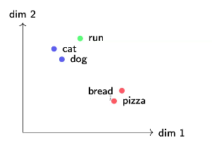

# Why and what is embedding?
## The Core Problem

Computers process numeric data. Words are discrete symbols with no intrinsic numerical representation. Converting "cat" to a number that encodes its meaning is non-trivial.

### Extra challenges with text:
* **Words are discrete** — there’s no “halfway between cat and dog”
* **Vocabulary is open-ended** — new words appear constantly
* **Meaning depends on context** — “bank” can mean money or a riverbank
* **Meaning isn’t additive** — “hot dog” $\neq$ hot + dog

# One-Hot Encoding: The Naïve Approach

Give each word its own dimension: cat = [1, 0, 0, 0], dog = [0, 1, 0, 0], pizza = [0, 0, 1, 0], . . .

### Why this fails:
* **Every pair of words is equally far apart**: $d(\text{cat, dog}) = d(\text{cat, pizza}) = \sqrt{2}$
* **The representation encodes zero semantic information**
* **With 50k words you get 50k-dimensional sparse vectors — wasteful**

We need something where **similar words get similar numbers**.

## The Embedding Idea

Map every word to a short, dense vector (e.g. 300 numbers) where **geometry reflects meaning**.

### What we want:
* **Similar words $\to$ nearby vectors** (cat $\approx$ dog)
* **Unrelated words $\to$ far apart** (cat $\neq$ bank)
* **Directions encode relationships**: king $-$ man $+$ woman $\approx$ queen

**But how do we *learn* these vectors?**

## The Distributional Hypothesis

> **"Words that appear in similar contexts tend to have similar meanings."**

* "The furry **cat** sat on the warm mat."
* "The playful **dog** sat on the warm mat."

"Cat" and "dog" keep showing up near the same words, so we push their vectors closer together.

This is the theoretical foundation behind **Word2Vec**, **GloVe**, and all distributional embeddings.

# How to learn embeddings?

## Word2Vec: Two Architectures

Both use a simple neural network. They just reverse the direction.

| CBOW                                                      | Skip-gram                                             |
| :-------------------------------------------------------- | :---------------------------------------------------- |
| Context words $\to$ predict center word                   | Center word $\to$ predict context words               |
| “The cat \_\_\_\_\_\_ on the” $\Rightarrow$ predict “sat” | “sat” $\Rightarrow$ predict “The”, “cat”, “on”, “the” |
| Average the context embeddings, then predict              | One word in, predict each neighbor independently      |

**Key insight:** No labels are needed. The text itself is the training signal — this is **self-supervised learning**.

The embeddings are the weight matrix $W$ of the network. They start random and get refined over millions of training examples. 

### How Training Works (Intuition)

1.  **Start with random vectors for every word**
2.  **Slide a window across the text, generating (context, target) pairs**. with fixed window size (not that big)
3.  **For each pair: the network predicts, gets it wrong, and adjusts the weights slightly**
4.  **Repeat for millions of examples**

Over time, words that keep appearing in similar contexts get pushed toward similar vectors. Words that never co-occur drift apart.

**The loss function** is just $-\log P(\text{correct word})$. Early on, the model is barely better than random. After billions of examples, it becomes very confident about which words belong near which other words.

## GloVe: Making the Statistics Explicit

**GloVe:** Build a word pair *frequency matrix* across the **entire corpus**. The *ratios* of co-occurrence counts encode semantic relationships.

### Example (10-word context window):
Count how many times two words appear within 10 words of each other, across the entire corpus:
* “ice” & “solid” appear together $\to$ 265 co-occurrences
* “steam” & “solid” appear together $\to$ 30 co-occurrences
* “ice” & “gas” appear together $\to$ 25 co-occurrences
* “steam” & “gas” appear together $\to$ 250 co-occurrences

The ratio $\frac{P(\text{solid|ice})}{P(\text{solid|steam})} = \frac{265}{30} \approx 8.9$ suggests that “solid” is strongly associated with “ice” but not “steam”.

# FastText: Handling Unknown Words

Word2Vec and GloVe assign one vector per word. If a word wasn’t in the training data (typos, rare words, new terms), it gets nothing.

**FastText’s idea:** Break words into character n-grams and sum their embeddings.

“playing” $\to$ `<pl, pla, play, lay, ayi, yin, ing, ng>, ...`
$$\mathbf{v}_{\text{playing}} = \sum \mathbf{v}_{\text{n-gram}}$$

### Why this helps:
* Unseen words can still get a vector from their n-grams
* Morphologically related words share n-grams (“unhappy” shares structure with “happy”)
* Especially useful for languages with rich morphology (Turkish, German)

**Trade-off:** Much larger model ($\sim$2M n-grams vs. 400K words $\Rightarrow$ 5$\times$ more parameters).

FastText's InnovationWord2Vec/GloVe Approach:"playing" $\rightarrow$ single atomic vector lookupIf "playing" not in vocabulary $\rightarrow$ <UNK>FastText Approach:"playing" $\rightarrow$ break into character n-grams:<pl, pla, play, playi, playin, playing><la, lay, layi, layin, laying><ay, ayi, ayin, aying><yi, yin, ying><in, ing><ng>Final embedding = sum of all n-gram embeddings

### n-gram Example
(exam question: list all n-gram tokens or given n, say how many tokens in n-grams
n-gram is a contiguous sequence of n items from a given sample of text or speech. always include \<S>\.
* **Word:** "unhappy" (add boundary markers: `<unhappy>`)

* **3-grams:** `<un, unh, nha, hap, app, ppy, py>`
* **4-grams:** `<unh, unha, nhap, happ, appy, ppy>`
* **5-grams:** `<unha, unhap, nhapp, happy, appy>`
* **6-grams:** `<unhap, unhapp, nhappy, happy>`

* **Total n-grams:** 25 (including the whole word)
* **Each n-gram gets its own embedding vector**

## Static vs. Contextual Embeddings
Everything we’ve seen so far — Word2Vec, GloVe, FastText — gives each word one fixed vector regardless of context. These are static embeddings.

The problem: “The river bank was steep” and “I went to the bank to deposit money” use completely different meanings of “bank,” but get the same vector.

Contextual embeddings (BERT, GPT) generate a different vector for each occurrence based on surrounding words.

“Bank” near “river” gets a water-related vector.

“Bank” near “deposit” gets a financial vector.

Key takeaway: Static embeddings are a compromise across all senses. This is a fundamental limitation, not a bug fixable with more data.

# Formulas and skills

## Cosine Similarity
Similarity of embedding is computed using cosine similarity (angle), not the Euclidean distance.

$$\cos(\mathbf{u}, \mathbf{v}) = \frac{u_1 v_1 + u_2 v_2}{\sqrt{u_1^2 + u_2^2} \sqrt{v_1^2 + v_2^2}}$$

Measures the angle between two vectors. Higher = more similar. Range: $[-1, 1]$.

**Example:** $(1, 4)$ vs. $(2, 3)$: $\cos = \frac{2+12}{\sqrt{17} \cdot \sqrt{13}} = \frac{14}{\sqrt{221}} \approx 0.941$

---

### Why not Euclidean distance?

**Example:** Two documents about "machine learning" could have different word frequencies. Document A uses 100 words total, Document B uses 1000 words, but they discuss the same topic. The **Euclidean distance** would say they’re very different (a large distance) due to the document length. **Cosine similarity** ignores length and measures whether they talk about the same topics in the same proportions.

## Analogy Arithmetic

$$\mathbf{t} = A - B + C \quad \text{then find the word with highest } \cos(\mathbf{t}, w)$$

Reads as: $A : B :: ? : C$.

**Example:** $\text{Paris}(1, 4) - \text{France}(2, 4) + \text{Italy}(2, 3.1) = (1, 3.1)$  
Nearest by cosine: $\text{Rome} (1, 3)$. $\quad \text{Paris} : \text{France} :: \text{Rome} : \text{Italy}$.

**Remember:** This only works when the two pairs share a consistent relationship. The math always gives an answer—it's your job to judge whether it's meaningful!

## Sentence Averaging & Stopwords
So far we talked about word embedding. Now how about setnence embediing? Simply, we can average all word vectors in a sentence: $\mathbf{\bar{v}} = \frac{1}{n} \sum \mathbf{v}_i$

**Stopword removal:** Words like "the," "of," and "and" add noise to the average because they appear everywhere and carry little meaning. Removing them lets content words dominate.

**TF-IDF weighting:** Instead of equal weights, give lower weight to words that appear in many documents (or both sentences). $\mathbf{\bar{v}} = \frac{\sum w_i \mathbf{v}_i}{\sum w_i}$ THis is to downeigh words like "the", "of"...

## CBOW Context Prediction

Given a target word and window size = 2:

1. Identify the 4 context words (2 left, 2 right of the target)
2. Average their embeddings
3. The word most similar to this average (by cosine) is what CBOW would predict

# practice problems

## 1
## Embedding Table

| Token     | Vector   | Token   | Vector |
| :-------- | :------- | :------ | :----- |
| berlin    | (2, 5)   | trade   | (3, 1) |
| germany   | (3, 5)   | law     | (2, 3) |
| madrid    | (2, 4)   | court   | (3, 0) |
| barcelona | (3.2, 4) | stream  | (0, 3) |
| spain     | (3, 4.1) | current | (0, 3) |
|           |          | the     | (1, 1) |
|           |          | and     | (1, 1) |

Q1. compute cosine similarity for Berlin-Madrid and Berlin-Barcelona. which pair is more similar?

Berlin–Madrid: $\frac{4+20}{\sqrt{29} \cdot \sqrt{20}} = \frac{24}{\sqrt{580}} \approx \mathbf{0.997}$

Berlin–Barcelona: $\frac{6.4+20}{\sqrt{29} \cdot \sqrt{26.24}} = \frac{26.4}{27.585} \approx \mathbf{0.957}$

**Berlin–Madrid** is more similar.

## Sentence Average

### Setup
* **S1** = [trade, law, and, the, court, berlin, germany]
* **S2** = [stream, current, madrid, barcelona, spain]

### Question
Compute average embeddings for S1 and S2, then cosine similarity.
- (a) Remove "and", "the" from S1. Recompute averages and cosine.
- (b) Compare before and after. What do you find?
- 
(a) S1 $\to$ [trade, law, court, berlin, germany]: $\mathbf{\bar{v}}_1 = (2.6, 2.8)$$$\cos \approx 0.948$$(b) Cosine similarity improved from $\approx 0.866$ to $\approx 0.948$ after removing stopwords. Removing “and” and “the” eliminates noise and reveals the semantic content more clearly.

### Practice 8: CBOW Prediction
Question
S1 = [trade, law, and, the, court, berlin, germany]. Window = 2.

(a) Find 4 context words. Average them. Is it more similar to court or law?
(b) “Current” appears equally near water and time words in training. How does that affect its embedding?