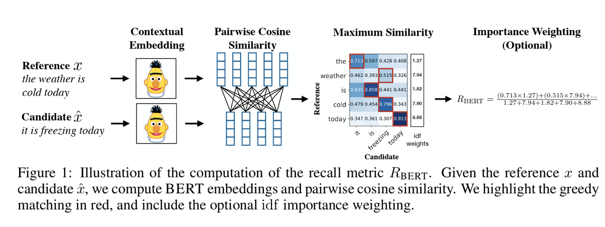

- It is absurd to do manual evaluation on LLM output. We need an automated way to evaluate LLM output. 
- Automatic evaluation methods aim to measure the same quantity that human evaluaator would consider: fluency, coherence, relevance, factual consistsency, faireness, similarity to reference, etc.
- The metrics are generally divided into two categories: reference-based metrics and reference-free metrics. 
- Reference here means human annotated groudn truth text. Basically prompt-answer pairs. You do not create them. You get it from somewhere else.
- When you are introduced to a new metric, the first thing you have to do is tell whether it is reference based on reference-free.

# Reference-based metrics
As Large Language Models (LLMs) become increasingly integrated into complex workflows, the question of **evaluation** has moved from a niche research topic to a critical engineering requirement. Unlike traditional software, where unit tests provide deterministic outcomes, LLMs are probabilistic, making "correctness" a moving target.

In this post, we explore the current landscape of LLM evaluation, covering essential metrics, popular benchmarks, and the emerging trend of using LLMs to judge other LLMs.

## BLEU: no semantic
BLEU is a useful baseline for large-scale evaluation, but not sufficient on its own — often combined with human evaluation or newer metrics


- Computes precision: TP/ (TP+FP). Out of total generated words, count how many are present in the reference.
- Do this for each sentences generated. Then average the scores.
- 0 to 1. higher is better. 1 is perfect. score 1 is rarely achieved. More references lead to higher scores.
- BLEU = BP * exp(weighted sum)
- BP = Brevity penalty. Multiplicative. Penalizes short test. It is 1 if the length of generated text is longer than reference text. Gets smaller as the length of generated text gets shorter.  
- weighted sum: just consider uniform weight. what is summed? log transformed modified precisions for each n-grams up to 4. But typically 1.
- modified precision: usual precision, but since the numerator cannot exceed the number of n-grams in the reference. 

### Limitations
- BLEU considers only n-grams. It does not consider semantic similarity. 
- Ignores synonyms
- One reference is not enough. Need many references for each sentence to get a good score.
- Harsh at sentence level, missing one gram drops the score significantly.
- Length biaas
- Not always human-aligned – Correlation with human judgments is decent for large corpora, but weaker for individual sentences or creative tasks.

## ROUGE: no semantic
- Based on recall.
- It has ROUGE-N (n-gram), ROUGE-S (skip bigram), ROUGE-L (longest common subsequence).
- ROUGE-N : n-gram based
- ROUGE-L: longest matching sequence base, rewarding fluency 
- similar limitation as BLEU.   favors longer outputs.

## BERTScore (ICLR 2020, Cornell): semantic similarity
- Use large pre-trained language model to compute contextual embeddings
- Encode both candidate and reference sentences into embeddings using BERT.
- For each token in candidate, find the most similar token in the reference (cosine similarity).
- Compute:
  - Precision: how well candidate tokens find good matches in the reference.
  - Recall: how well reference tokens are covered by candidate tokens.
  - F1: harmonic mean of precision and recall.
<p>
\begin{equation*}
\text{Precision} = \frac{1}{|c|} \sum_{t \in c} \max_{r \in R} \cos(e_t, e_r)
\end{equation*}
\begin{equation*}
\text{Recall} = \frac{1}{|r|} \sum_{r \in R} \max_{t \in c} \cos(e_t, e_r)
\end{equation*}
</p>



### why good?
- Captures meaning, not just word overlap: “the cat is on the mat” vs. “the feline lies on the rug” → BLEU/ROUGE: low, BERTScore: high.
- Language-aware:  Uses contextual embeddings, so “bank” (river bank vs. financial bank) is disambiguated.
- Better correlation with human judgments than BLEU/ROUGE, especially at sentence level.
- Supports multiple languages and tasks.

### limitations
- Dependent on the choice of pretrained model (BERT vs. RoBERTa vs. multilingual models).
- Computationally more expensive than n-gram counts.
- Scores can be high even if output is fluent but factually wrong (semantic similarity ≠ truth).
- Not always interpretable (no easy “matched n-grams” to point to).

# Reference-free metrics

## BLANC: quality-based metrics for summarizations
- Measures the accuracy difference when reconstructing masked tokens in the source text, with and without the summary as context.
- The core idea behind BLANC is to measure the utility of a summary. 
- Instead of comparing it to a human-written reference, BLANC asks: "Does this summary help a language model better understand the original document?"
A good summary should contain the key information from the source. Therefore, giving this summary to a language model should improve its performance on a task related to that source document.

### How it works

1. The Source Document:
```The James Webb Space Telescope (JWST) is the largest optical telescope in space. A collaboration between NASA, ESA, and CSA, its high-resolution instruments allow it to observe some of the most distant events and objects in the universe, such as the formation of the first galaxies.```

2. The Generated Summary:
```The JWST, a large space telescope from NASA, ESA, and CSA, can see the first galaxies.```

3. Masking the Source: BLANC takes the original source document and "masks" (blanks out) important keywords, typically nouns and verbs.
```The James Webb Space Telescope (JWST) is the largest optical [MASK] in space. A [MASK] between NASA, ESA, and CSA, its high-resolution instruments allow it to [MASK] some of the most distant events and objects in the universe, such as the formation of the first galaxies.```

4. The Two Test Conditions:
    - Condition A (Baseline): A pre-trained language model (like BERT) is asked to fill in the blanks in the masked source without any other context.
    - Let's say the model predicts:
    ```[MASK] -> "telescope" (Correct)
    [MASK] -> "project" (Incorrect, the word was "collaboration")
    [MASK] -> "see" (Incorrect, the word was "observe")
    ```
    - Baseline Accuracy: 1 out of 3 correct = 33%

    - Condition B (Summary-Cued): The same model is now given the generated summary as context and asked to fill in the same blanks.
    - Now with the context: "The JWST, a large space telescope... can see the first galaxies."
    - The model predicts:
    ```
    [MASK] -> "telescope" (Correct)
    [MASK] -> "collaboration" (Correct)
    [MASK] -> "observe" (Correct)
    ```
    - Summary-Cued Accuracy: 3 out of 3 correct = 100%
5. Calculating the BLANC Score:
    - The final BLANC score is simply the difference in accuracy between the summary-cued condition and the baseline.
    - BLANC Score = (Summary-Cued Accuracy) - (Baseline Accuracy)
    - BLANC Score = 100% - 33% = 67%

# LLM-as-a-Judge
- Key Advantages:
    - Scalability: Can automate evaluation for large datasets.
    - Explainability: Can provide natural language explanations for their scores, unlike traditional numerical metrics.
- How it Works: An LLM is prompted to act as a "judge" of a piece of text based on specific criteria.

### criteria
LLM evaluators can judge text based on different inputs:
- Text Alone (Reference-Free): Judges intrinsic qualities like fluency and coherence.
- Generated Text + Source Text (Reference-Free): Judges qualities like consistency, relevance, and factuality against the original context.
- Generated Text + Ground Truth (Reference-Based): Judges quality and similarity compared to a human-written reference.

## How it works
-  LLM-as-a-Judge uses *in-context learning* methods, which provide *instructions* and *examples* to guide the model’s reasoning and judgment. 
- What we have to do: input design and prompt design

- Based on the instructions and examples, the LLM can generate a score, a ranking, a category, or a natural language explanation.

### Generating scores
- use Likert scale scoring functions as an absolute evaluative measure. 
- The evaluator assigns scores
to a given response along predefined dimensions, including accuracy, coherence, factuality, and
comprehensiveness. Each of these dimensions is scored on a scale of 1 to 3, ranging from worst to
best. 
- The evaluator is also asked to provide an overall score ranging from 1 to 5, based on the scores
assigned to the previous 4 dimensions. This score serves as an indicator of the overall quality of
the answer.

```
Likert Scale Scoring:
Evaluate the quality of summaries written for a news article. Rate each summary on four
dimensions: {Dimension_1}, {Dimension_2}, {Dimension_3}, and {Dimension_4}. You should
rate on a scale from 1 (worst) to 5 (best).
Article: {Article}
Summary: {Summary}
```
 
### pairwise comparisons

### Solving Yes/No questions

### Making multiple-choice selections
