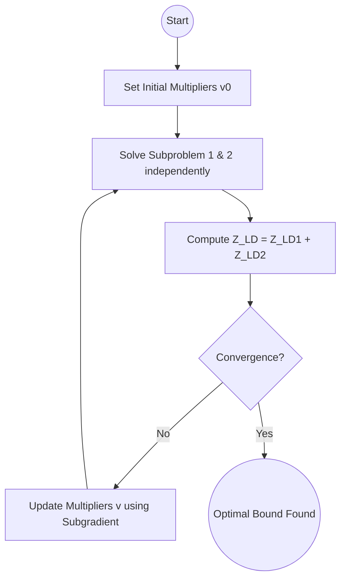

# Basics on decomposition methods 

## Separable Problem

**Minimize:** $$f_1(x_1) + f_2(x_2)$$

**Subject to:** $$x_1 \in C_1, \quad x_2 \in C_2$$

* We can solve for $x_1$ and $x_2$ separately (in parallel).
* Even if they are solved sequentially, this gives an advantage if the computational effort is superlinear in problem size.

### Newton's method example
* For example, if the problem is convex and objective is smooth and we are using newtons method, we move from $(n_1 + n_2)^3$ to $n_1^3 + n_2^3$. This is a significant improvement.
* Let's dig more. Hessian is block-diagonal. what if our linear algebra algorithm is very efficient for block-diagonal matrices? Actually any sparse solvers recognize the block diagonal structure and solves linear equation in $O(n_1^3 + n_2^3)$.
* Actially cvx is very good at finding and exploiting the separable structure.

* In conclusion, separable problems are easy. No brainer. CVX handles everyting.
* This is called **separable** or **trivially parallelizable**.
* Generalizes to any objective of the form $\Psi(f_1, f_2)$ with $\Psi$ nondecreasing (e.g., $\max$).

## Complicating Variable

Consider the unconstrained problem:

**Minimize:** $$f(x) = f_1(x_1, y) + f_2(x_2, y)$$

where $$x = (x_1, x_2, y)$$

* $y$ is the **complicating variable** or **coupling variable**; when it is fixed, the problem is separable in $x_1$ and $x_2$.
* $x_1$ and $x_2$ are **private** or **local variables**; $y$ is a **public**, **interface**, or **boundary variable** between the two subproblems.

## Primal Decomposition

### With fixed public variable
Fix $y$ and define:

**Subproblem 1:**
$$\text{Minimize}_{x_1} \quad f_1(x_1, y)$$

**Subproblem 2:**
$$\text{Minimize}_{x_2} \quad f_2(x_2, y)$$

- Each problem is independently solved by each firm. Any method each likes. no communicaiton needed between firms.
- Resulting optimal values denoted as $\phi_1(y)$ and $\phi_2(y)$. We view it as a function of $y$.
  
### Master problem
- the original problem is equivalent to the **master problem**:

**Minimize:** $$\phi_1(y) + \phi_2(y)$$

with variable $y$.

- If the original subproblems are convex, then the master problem is convex due to partial minimizaiton rule
* This is called **primal decomposition** since the master problem manipulates primal (complicating) variables.

### The algorithm for primal decomposition
* If the original problem is convex, so is the master problem.
* Vairous ways to solve the master problem. For example, **bisection** (if $y$ is scalar), **gradient or Newton methods** (if $\phi_i$ is differentiable; but they are rarely differentiable in practice), or **subgradient, cutting-plane, or ellipsoid methods**.
* Each iteration of the master problem requires solving the two subproblems (in parallel).
* If the master algorithm converges fast enough and the subproblems are sufficiently easier to solve than the original problem, we achieve computational savings.

### Primal Decomposition Algorithm
*(Using subgradient algorithm for master)*

**Repeat:**

1. **Solve the subproblems (in parallel).** Find $x_1$ that minimizes $f_1(x_1, y)$ with subgradient $g_1 \in \partial\phi_1(y)$, and find $x_2$ that minimizes $f_2(x_2, y)$ with subgradient $g_2 \in \partial\phi_2(y)$.
2. **Update the complicating variable:** $$y := y - \alpha_k(g_1 + g_2)$$

*Note: The step length $\alpha_k$ can be chosen in any of the standard ways.*
- the subproblem solver do not even have to reveal their x value. they just send their subgradient to the master problem solver. In the simplest setting doesnot even have to reveal what $f_1$ vlaue it achieved .

### Modern viewpoint
- the decomposition above was develpoped in 1960s where technology was primintive
- Nowdays, if you can collect the problem data for all $f_1, ... f_k$, just solving in one shot is better.
- Still nowadays this is meaningful because in many cases firms do not share data. so not for efficiency but for  .

### Hessian
in the linear algebra level, sturctuer can be exploted.
how the hessian look like for complicating variable case?

block elimination
shur complement
block diagonal submatrix

## Dual decomposition
- Copy and link.
  
**Step 1: introduce new variables $y_1$, $y_2$**

$$
\begin{aligned}
\text{minimize} \quad & f(x) = f_1(x_1, y_1) + f_2(x_2, y_2) \\
\text{subject to} \quad & y_1 = y_2
\end{aligned}
$$

* $y_1$, $y_2$ are **local** versions of complicating variable $y$
* $y_1 = y_2$ is consistency constraint

**Step 2: form dual problem**

$$L(x_1, y_1, x_2, y_2) = f_1(x_1, y_1) + f_2(x_2, y_2) + \nu^T(y_1 - y_2)$$

**separable**; can minimize over $(x_1, y_1)$ and $(x_2, y_2)$ separately

$$
\begin{aligned}
g_1(\nu) &= \inf_{x_1, y_1} (f_1(x_1, y_1) + \nu^T y_1) = -f_1^*(0, -\nu) \\
g_2(\nu) &= \inf_{x_2, y_2} (f_2(x_2, y_2) - \nu^T y_2) = -f_2^*(0, \nu)
\end{aligned}
$$

dual problem is: $\text{maximize} \quad g(\nu) = g_1(\nu) + g_2(\nu)$

* computing $g_i(\nu)$ are the **dual subproblems**
* can be done in parallel. link is via the lagrange multiplier now. subproblems can yield different $y$ value
* a subgradient of $-g$ is $y_2 - y_1$ (from solutions of subproblems)
# Introduction

In large-scale optimization, the challenge often lies in **complicating constraints**—constraints that, if removed, would allow the problem to decompose into smaller, independent subproblems. **Lagrangean Decomposition** is a powerful technique designed to exploit such structures, providing tighter bounds than standard LP relaxations and enabling the solution of massive-scale Mixed-Integer Linear Programs (MILP) and Nonlinear Programs (MINLP).

This tutorial follows the theoretical foundations and industrial applications developed by **Ignacio Grossmann** and **Bora Tarhan** at Carnegie Mellon University.

# Theory of Lagrangean Relaxation

Consider a Mixed-Integer Programming (MIP) problem with complicating constraints:

$$
\begin{aligned}
Z = \min \quad & c^T x \\
\text{s.t.} \quad & A x \ge b \quad \color{red}{\text{(Complicating Constraints)}} \\
& D x \ge e \quad \color{blue}{\text{(Easy Constraints)}} \\
& x \in \mathbb{Z}^n_+
\end{aligned}
$$

The **Lagrangean Relaxation** absorbs the complicating constraints into the objective function with a penalty term (Lagrangean multiplier $u \ge 0$):

$$
Z_{LR}(u) = \min_{x \in X} \{ c^T x + u^T (b - Ax) \}
$$

where $X = \{ x \in \mathbb{Z}^n_+ : Dx \ge e \}$.

### The Lower Bound Property
For any $u \ge 0$, $Z_{LR}(u)$ provides a lower bound to the original minimization problem. This is because:
1. Removing $Ax \ge b$ relaxes the feasible space.
2. For any feasible $x$, $(b - Ax) \le 0$, and since $u \ge 0$, the penalty term $u^T(b - Ax) \le 0$.

### The Lagrangean Dual
To find the tightest bound, we solve the **Lagrangean Dual**:
$$ Z_D = \max_{u \ge 0} Z_{LR}(u) $$

### Graphical Interpretation
Optimizing the Lagrangean multipliers can be interpreted as optimizing the primal objective function on the **intersection of the convex hull** of the easy constraints and the LP relaxation of the complicating constraints.

$$ Z_D = \min \{ c^T x : x \in \text{Conv}(Dx \ge e, x \in \mathbb{Z}^n_+) \cap \{ x : Ax \ge b \} \} $$

As established by , Lagrangean relaxation yields a bound at least as tight as the LP relaxation:
$$ Z_{LP} \le Z_D \le Z(P) $$

---

# Lagrangean Decomposition

**Lagrangean Decomposition** (or Variable Splitting) is a special case of relaxation. Instead of dualizing existing constraints, we define separate variables for different sets of constraints and add a "linking constraint" equating them.

Consider:
$$ Z = \min \{ c^T x : Ax \ge b, Dx \ge e, x \in \mathbb{Z}^n_+ \} $$

We split $x$ into $x$ and $y$:
$$
\begin{aligned}
Z = \min \quad & c^T x \\
\text{s.t.} \quad & Ax \ge b, x \in \mathbb{Z}^n_+ \\
& Dy \ge e, y \in \mathbb{Z}^n_+ \\
& x = y \quad \color{red}{\text{(Linking Constraint)}}
\end{aligned}
$$

Dualizing $x = y$ with multipliers $v$ (unrestricted in sign) yields:
$$ Z_{LD}(v) = \min_{x, y} \{ c^T x + v^T (y - x) : Ax \ge b, Dy \ge e, x, y \in \mathbb{Z}^n_+ \} $$

### Variable Splitting
The problem decomposes into two independent subproblems:
1. **Subproblem 1**: $\min \{ (c - v)^T x : Ax \ge b, x \in \mathbb{Z}^n_+ \}$
2. **Subproblem 2**: $\min \{ v^T y : Dy \ge e, y \in \mathbb{Z}^n_+ \}$

### Solution Methods
The dual problem is solved iteratively to update multipliers $u$ or $v$:
- **Subgradient Optimization**: $u^{k+1} = u^k + \alpha_k (b - Ax^k)$.
- **Cutting Plane Method**: Construct an approximation of the convex dual function using extreme points.

### Decomposition Scheme
The overall algorithm for Lagrangean decomposition can be visualized as an iterative feedback loop between the master problem (multiplier update) and the subproblems.

---

# Deep-Dive Applications

Lagrangean decomposition is particularly effective in high-stakes engineering decisions.

## 1. Offshore Oil Infrastructures
Managing the design and planning of offshore hydrocarbon fields involves complex economic objectives (Minimize Total Cost) across multiple time periods.



**Motivation**: Complex royalties and taxes are often local to specific platforms. By dualizing the linking flows between platforms, the model decomposes into independent models for each Well Platform (WP).
- **Result**: In one example with 16 WPs and 15 time periods, the full space model yielded no solution in 5 days, while Lagrangean decomposition found a high-quality solution with only a 1.9% gap .

## 2. Pharmaceutical New Product Development
The simultaneous optimization of testing tasks (clinical trials) and batch plant manufacturing facilities is a massive MILP.



**The Trick**: Decouple the **Scheduling** of tests from the **Design/Planning** of the manufacturing site.
- **Impact**: Reduced Total Cost by over 7% compared to simple heuristics by properly handling the risk of falling tests and investment timing .

## 3. Multisite Distribution Networks
Global multisite distribution involves determining product manufacturing sites and supply chains for multiple markets.

**Spatial vs. Temporal Decomposition**:
- **Spatial**: Decompose by site or market.
- **Temporal**: Decompose by time period.
- **Finding**: Temporal decomposition often yields much smaller duality gaps (~2.2%) because material balances are not violated at each time period .

## 4. Stochastic Gasfield Planning
Gasfield planning under uncertainty leads to massive scenario trees.



**Non-Anticipativity**: Scenarios are linked by non-anticipativity constraints (decisions must be the same if scenarios have not yet diverged).
- **Strategy**: Dualize the non-anticipativity constraints. The model then decomposes into **one MILP for each scenario** .

---

# Concluding Remarks

1. **Wait, how to decompose?** The non-obvious part is choosing *which* equations to dualize. Avoid relaxing "critical" constraints like mass balances if possible.
2. **Tightness**: Lagrangean decomposition is theoretically at least as tight as standard Lagrangean relaxation, as it optimizes over the intersection of convex hulls of constraint sets.
3. **Dual Gap**: While theoretically powerful, the dual gap varies by problem. Experience shows the gap often decreases as problem size increases in structured industrial models.

For a deeper dive, see the foundational work by  and the applications by .

# References


