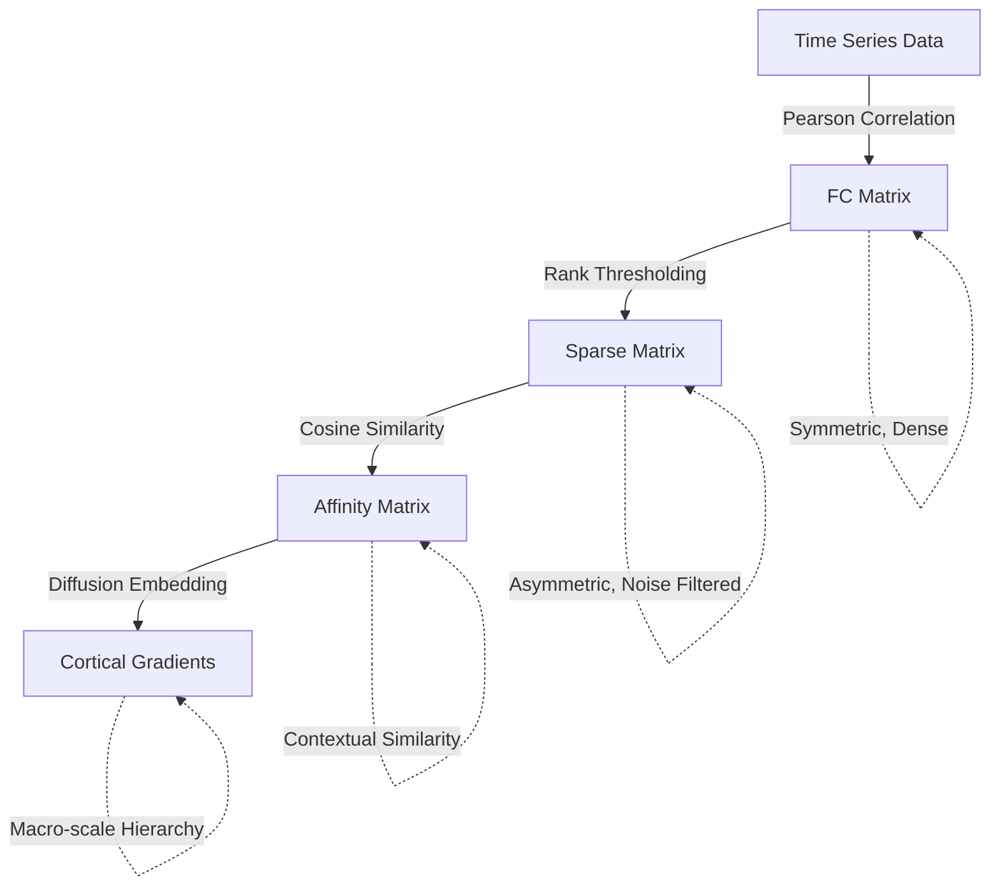

## I. Core Concept: Functional Connectivity (FC)

### 1. Definition
Functional Connectivity (FC) refers to the **statistical dependence** between the time-series activity of spatially distinct brain regions, distinct from their physical connections. While structural connectivity describes the physical "wiring" (axons/white matter), functional connectivity captures the temporal correlation of neural signals.

### 2. Key Characteristics
*   **Measurement Modalities:**
    *   **fMRI (Functional MRI):** Measures **hemodynamic activity** (blood flow/oxygenation) as an indirect proxy for neural activity. Good spatial resolution, low temporal resolution.
    *   **EEG / MEG:** Measures **electrical/magnetic activity** directly. Excellent temporal resolution, lower spatial resolution.
*   **Mechanism:** Connections are inferred when signals from two separate regions fluctuate in synchrony. Basically, computing correlation.
*   **Structural vs. Functional:** A functional connection does not imply a direct anatomical link; two regions may show high correlation because they are both driven by a shared third source (indirect connection).

### 3. Importance: Network Integration
The brain is not distinguishable solely by isolated regions but by large-scale networks. FC reveals how the brain integrates information across distributed systems to support cognition.

**Resting State Networks (RSNs):**
Even when a subject is doing nothing ("resting state"), the brain maintains intrinsic synchronized activity organized into networks, such as:
*   **Default Mode Network (DMN):** Active during internal thought, memory, and self-reference.
*   **Visual Network:** Active during visual processing.

## II. Functional Gradients: Low-Dimensional Representation

### 1. The High-Dimensionality Challenge
*   **The Problem:** Functional connectivity analysis generates a $p \times p$ matrix, where $p$ is the number of brain regions. If $p=400$, each region is defined by a complex 400-dimensional connectivity vector. This high-dimensional space is noisy, difficult to visualize, and computationally expensive to model.
*   **The Solution:** Dimensionality reduction techniques (e.g., PCA, t-SNE, Diffusion Mapping) are applied to extract the "dominant axes" of variance. These axes represent the underlying organizational principles of the brain.

### 2. What is a "Gradient"?
A **Functional Gradient** is a PC score. It is a continuous coordinate system for the brain. Instead of forcing regions into discrete "clusters", a gradient places every region along a continuous spectrum based on the similarity of their connectivity profiles.

### 3. Why use Functional Gradients?
It is low-dimensional but encodes the brain activity sufficiently well. For example, gradients provide a parsimonious representation of the **Cortical Hierarchy**, revealing the transition from sensation to abstraction:

*   **Efficiency:** They condense complex connectivity patterns into a single, biologically interpretable axis.
*   **The Principal Gradient (Cortical Hierarchy) distinguishes:**
    *   **Anchor 1: Unimodal (Low-Level):** Primary sensory/motor regions (e.g., Visual Cortex) that process immediate external stimuli.
    *   **Anchor 2: Transmodal (High-Level):** Association regions (e.g., Default Mode Network) involved in abstract, internal cognition like memory and planning.
    *   **Insight:** This gradient captures the fundamental biological principle of how the brain abstracts raw sensory data into high-level thought. 
---

## III. Data Acquisition Workflow 

This workflow moves beyond simple "Region A connects to Region B" analysis to map the macro-scale hierarchy of the brain.

### 1. Workflow Steps

1.  **Construct Connectivity Matrix:**
    *   *Input:* Time-series data for $p$ regions.
    *   *Operation:* Pearson correlation between all pairs.
    *   *Result:* **Symmetric, Dense Matrix**.
2.  **Row-wise Thresholding:**
    *   *Operation:* For each row, keep only the top 10% strongest connections.
    *   *Result:* **Sparse, Asymmetric Matrix**. (Asymmetry arises because being in A's top 10% doesn't guarantee A is in B's top 10%).
    *   *Purpose:* Filter out noise and weak correlations.
3.  **Affinity Matrix Calculation:**
    *   *Operation:* Compute **Cosine Similarity** between the sparse rows (connectivity profiles).
    *   *Question:* "Do Region A and Region B have similar 'friends' (connectivity patterns)?"
    *   *Result:* **Symmetric Affinity Matrix**. represents *contextual similarity*, not direct correlation.
4.  **Dimensionality Reduction:**
    *   *Operation:* Apply **Diffusion Map Embedding**.
    *   *Result:* **Principal Gradients**. Each region gets a coordinate/score along these axes.

### 2. Summary Flowchart

 